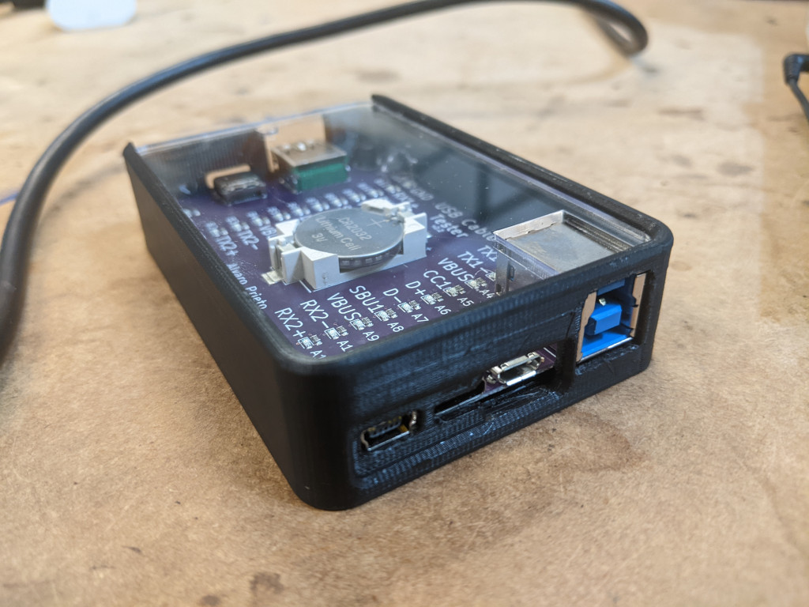

# USB Cable Tester Case - Modded for USB 3.0 Type B connector

## A 3d printable case for Alvaro Prieto's USB C Cable Tester

(also requires a laser cutter for the acrylic top panel)

[USB C Cable Tester](https://github.com/alvarop/usb_c_cable_tester) - [original Twitter thread descibing the tester](https://twitter.com/alvaroprieto/status/1594036248481771520)

Having purchased an assembled USB C Cable Tester v2.2, I printed [this very nice case](https://github.com/coryalder/usb-c-tester-case) by Cory Alder. However I found the case did not accomodate the height of the USB 3.0 Type B connector used on the I board received.

I set about modifying the case by hand, making the cutout for the Type B connector taller and removing some material underneath the board to make space for some of the through-hole pins. It was also necessary to add a cutout to the laser-cut acrylic top panel (thanks Mitch!) as the taller connector prevented the panel from sliding closed.

This fork exists to capture these modifications for the benifit of anyone with a similar board. However please note the following:
- I have only modified the "case-without-screw-tower" version.
- I have removed the "case-with-screw-tower" since it is unmodified and the original author does not recommend its use.
- I have not yet printed and tested the modified .stl file.
- I have not yet incorporated the changes to the laser-cut acrylic top panel into the .f3z file - I'm not a Fusion user and lost patience - but you can rely on the .dxf file.

